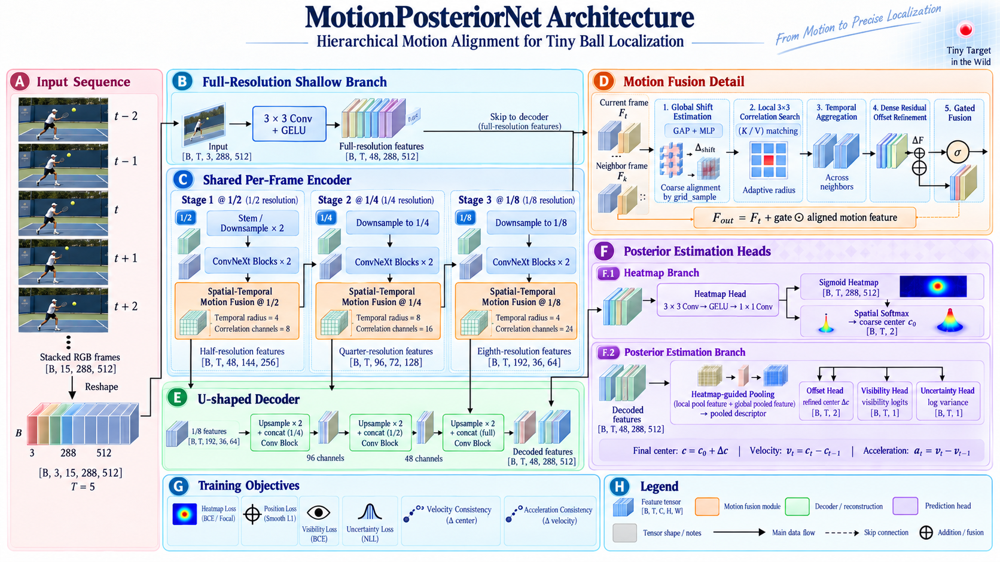

# MotionPosterior：面向高速小目标的运动条件后验估计

**[English README](README.md)**

**基于 TrackNetV5 迭代的高速小目标运动后验估计模型 PyTorch 实现。**

本仓库提供 MotionPosterior 的模型实现、训练框架、数据预处理工具和评估接口。模型保留 TrackNetV5 的高效三帧建模形式，并扩展到对称五帧和因果五帧推理；输出从热力图定位扩展为包含几何偏移、可见性和定位不确定度的时空后验。

## 摘要

TrackNetV5 通过带符号的运动方向信息和残差式时空精修实现高速目标跟踪。MotionPosterior 在此基础上，将以图像差分为主的时序交互升级为特征级时序配准与局部对应。分层 ConvNeXt V2 风格编码器在四个尺度提取高分辨率与上下文特征；有界的可学习全局平移补偿、速度条件局部相关和 dense offset 精修共同构成运动表示。解码器同时预测热力图后验、中心偏移、可见性、定位不确定度、速度和加速度，并为每个输入帧保留 dense 输出。

## 方法概览



*图 1. MotionPosteriorNet 五帧版本的结构示意。实际实现的输入为 `[B, 15, H, W]`，精确的模块参数以代码为准。*

部署阶段按以下顺序解码：

```text
heatmap candidate → offset refinement → visibility gate → uncertainty
```

张量契约、监督信号和模块定义见[模型设计文档](docs/MotionPosterior.md)。

## 时序协议

| 配置 | 输入窗口 | 输出 |
| --- | --- | --- |
| `motion_posterior3` | `[t-1, t, t+1]` | 3 张热力图及后验量 |
| `motion_posterior5` | `[t-2, t-1, t, t+1, t+2]` | 5 张热力图及后验量 |
| `motion_posterior5_causal` | `[t-4, t-3, t-2, t-1, t]` | 5 张热力图及后验量 |

中心窗口和因果窗口应分别评估。当既有流程要求输入和输出保持相同帧数时，可使用 `chunk` 推理模式。

## 安装

推荐使用 Python 3.10。请先安装与本机 CUDA 运行时匹配的 PyTorch/torchvision，再安装其余依赖：

```bash
pip install torch torchvision
pip install -r requirements.txt
```

本项目不依赖第三方光流包，完整依赖见 [`requirements.txt`](requirements.txt)。

## 数据准备

数据流程在 [TrackNetV5 SDK](https://github.com/codelancera-offical/TrackNetV5-SDK) 的三帧上下文构造方式上扩展五帧窗口。先准备已抽取的视频帧及每个 clip 的 `Label.csv`。预处理脚本读取标注、生成高斯监督图和时序窗口索引，并按 clip 划分训练/验证 CSV；它不负责从视频抽帧。

### 原始数据目录

每个 clip 需要包含帧文件和对应标注：

```text
data/benchmark/
├── clip_0001/
│   ├── frame_000001.jpg
│   ├── frame_000002.jpg
│   ├── ...
│   └── Label.csv
├── clip_0002/
│   ├── frame_000001.jpg
│   ├── ...
│   └── Label.csv
└── ...
```

`Label.csv` 必须包含以下字段：

| 字段 | 含义 |
| --- | --- |
| `file name` | 相对于当前 clip 目录的帧文件名 |
| `x-coordinate` | 原始帧像素坐标中的目标 x 坐标 |
| `y-coordinate` | 原始帧像素坐标中的目标 y 坐标 |
| `visibility` | 目标可见为 `1`，不可见为 `0` |
| `status` | 保留到时序 CSV 的帧/状态标签 |

标注示例：

```csv
file name,x-coordinate,y-coordinate,visibility,status
frame_000001.jpg,417,201,1,0
frame_000002.jpg,,,0,0
```

CSV 行必须按时间顺序排列：窗口顺序由 CSV 行序决定。目标可见时，两个坐标都必须使用原始帧的像素坐标；不可见时将 `visibility` 设为 `0`，未知坐标可以留空。`status` 列需要保留，虽然它不直接参与训练监督。

### 监督图与输出目录

脚本会为每一帧在 `gts/` 下生成灰度高斯热力图，并保留原始 clip 的相对目录结构。可见目标使用 `--size` 作为高斯核半径、`--variance` 作为方差；不可见目标生成全零热力图。监督图保存为 `[0, 255]` 的软 `uint8` 图像，训练 pipeline 再将其缩放到模型输入分辨率。

生成后的目录结构如下：

```text
data/benchmark/
├── clip_0001/                 # 原始帧与 Label.csv 保留在此
├── clip_0002/
├── gts/clip_0001/<frame>.png
├── gts/clip_0002/<frame>.png
├── labels_context_train.csv   # 运行三帧命令后生成
├── labels_context_val.csv
├── labels_context5_train.csv  # 运行五帧中心命令后生成
├── labels_context5_val.csv
├── labels_causal5_train.csv   # 运行五帧因果命令后生成
└── labels_causal5_val.csv
```

每个上下文 CSV 包含相对于 `data/benchmark/` 的原帧与热力图路径，以及坐标、visibility、status。clip 标识只在划分时使用，不写入最终 CSV。数据加载器保持显式时序顺序，输出按通道拼接的图像 `[3T, H, W]`、目标 `[T, H, W]`、坐标 `[T, 2]` 和 visibility `[T]`。

### 时序窗口构造

| 模式 | 窗口 | 每个 clip 边界删除的行 | 输出 CSV |
| --- | --- | --- | --- |
| 三帧中心 | `[t-1, t, t+1]` | 两端各 1 帧 | `labels_context_{train,val}.csv` |
| 五帧中心 | `[t-2, t-1, t, t+1, t+2]` | 两端各 2 帧 | `labels_context5_{train,val}.csv` |
| 五帧因果 | `[t-4, t-3, t-2, t-1, t]` | 开头 4 帧 | `labels_causal5_{train,val}.csv` |

没有完整上下文的边界行会在预处理阶段删除。因果窗口不会读取未来帧。以下实验使用 `--mode context`。

### 划分策略与参数

划分以 clip 为单位执行，不按窗口随机划分，避免相邻帧同时出现在训练集和验证集。划分器使用固定随机种子 `42`，并要求至少两个能构成完整窗口的 clip。`--train_rate` 控制训练 clip 比例。`--height` 和 `--width` 应设置为像素标注所对应的原始帧尺寸：脚本直接在该坐标系绘制热力图，不会自行缩放标注。默认尺寸为 `1080 × 1920`；训练 pipeline 再把图像、热力图和坐标缩放到 `288 × 512`。若原始尺寸不同，还需同步修改所选训练配置中的 `original_size`。

以下命令把 `./data/benchmark` 同时作为输入和输出，因为现有训练配置会从该根目录读取原帧及生成的 `gts/`。三条命令可在同一目录依次执行，每条生成一对训练/验证 CSV。

三帧上下文：

```bash
python tools/preprocess_data_gauss.py \
  --input_dir ./data/benchmark \
  --output_dir ./data/benchmark \
  --mode context \
  --num-frames 3 \
  --train_rate 0.8
```

五帧中心上下文：

```bash
python tools/preprocess_data_gauss.py \
  --input_dir ./data/benchmark \
  --output_dir ./data/benchmark \
  --mode context \
  --num-frames 5 \
  --window-type center \
  --train_rate 0.8
```

五帧因果上下文：

```bash
python tools/preprocess_data_gauss.py \
  --input_dir ./data/benchmark \
  --output_dir ./data/benchmark \
  --mode context \
  --num-frames 5 \
  --window-type causal \
  --train_rate 0.8
```

中心五帧数据生成 `labels_context5_{train,val}.csv`，因果五帧数据生成 `labels_causal5_{train,val}.csv`。

## 训练

训练配置位于 [`configs/`](configs/)：

* `motionposterior_convnext_3frames.py`
* `motionposterior_convnext_5frames.py`
* `motionposterior_convnext_5frames_causal.py`

启动训练并在交互菜单中选择配置：

```bash
python train.py
```

训练目标由热力图监督和 visibility 掩码的几何监督组成，包含中心 offset、异方差不确定度、速度和加速度项。数据中存在真实坐标与可见性标注时，损失函数直接使用这些标注。checkpoint 保存模型、优化器、调度器、训练进度、配置和随机数状态。

## 推理

批量推理接口接收模型 checkpoint 和视频目录，当前流程将输入缩放至 `512 × 288`，并为每个视频写出一个 CSV 文件。

五帧离线推理：

```bash
python track.py <video_dir> <checkpoint.pth> \
  --arch motion_posterior5 \
  --window-mode center \
  --output-dir <output_dir> \
  --threshold 0.5 \
  --device cuda:0
```

五帧在线推理：

```bash
python track.py <video_dir> <checkpoint.pth> \
  --arch motion_posterior5_causal \
  --window-mode causal \
  --output-dir <output_dir> \
  --threshold 0.5 \
  --device cuda:0
```

标准输出字段为：

```text
benchmark_id,video_name,frame_number,detected,x_512,y_288,x_orig,y_orig,conf,fps,width,height
```

如需输出轨迹和热力图视频，增加 `--visualization-dir <dir>`。

## 评估协议

为保证可复现性，应固定视频级数据划分、输入分辨率、高斯目标参数、阈值和时序协议。建议至少报告：

* PCK/EPE 和像素定位误差；
* 可见目标召回率、miss rate、误检率和 visibility recall；
* P50/P90/P95 定位误差；
* 吞吐率和端到端延迟。

三帧中心、五帧中心、五帧因果和 `chunk` 结果应分别报告。结构 smoke test 或论文中的已有指标不能替代在目标数据划分上的重新训练与评估。

## 基线与参考文献

仓库保留 TrackNetV5 配置，用于与前代架构进行直接比较；MotionPosterior 是在该架构基础上发展的主线模型。同时提供 TrackNetV3 和 TrackNetV4 的 PyTorch 结构实现作为额外参考。

* [TrackNetV5: Residual-Driven Spatio-Temporal Refinement and Motion Direction Decoupling](https://arxiv.org/abs/2512.02789)
* [TrackNetV4: Enhancing Fast Sports Object Tracking with Motion Attention Maps](https://arxiv.org/abs/2409.14543)
* [TrackNetV3 repository](https://github.com/qaz812345/TrackNetV3)
* [ConvNeXt V2](https://openaccess.thecvf.com/content/CVPR2023/html/Woo_ConvNeXt_V2_Co-Designing_and_Scaling_ConvNets_With_Masked_Autoencoders_CVPR_2023_paper.html)
* [LSTFE-Net](https://openaccess.thecvf.com/content/CVPR2023/html/Xiao_LSTFE-NetLong_Short-Term_Feature_Enhancement_Network_for_Video_Small_Object_Detection_CVPR_2023_paper.html)

## 引用

如果使用本项目，请引用 TrackNetV5 前代工作，并在 MotionPosterior 论文发布后补充对应引用：

```bibtex
@article{tang2025tracknetv5,
  title   = {TrackNetV5: Residual-Driven Spatio-Temporal Refinement and Motion Direction Decoupling for Fast Object Tracking},
  author  = {Tang, Haonan and Chen, Yanjun and Jiang, Lezhi},
  journal = {arXiv preprint arXiv:2512.02789},
  year    = {2025}
}
```

## 许可证

代码、模型权重和数据的使用以项目所有者公布的许可条款为准。训练数据和预训练 checkpoint 不包含在本仓库中。
